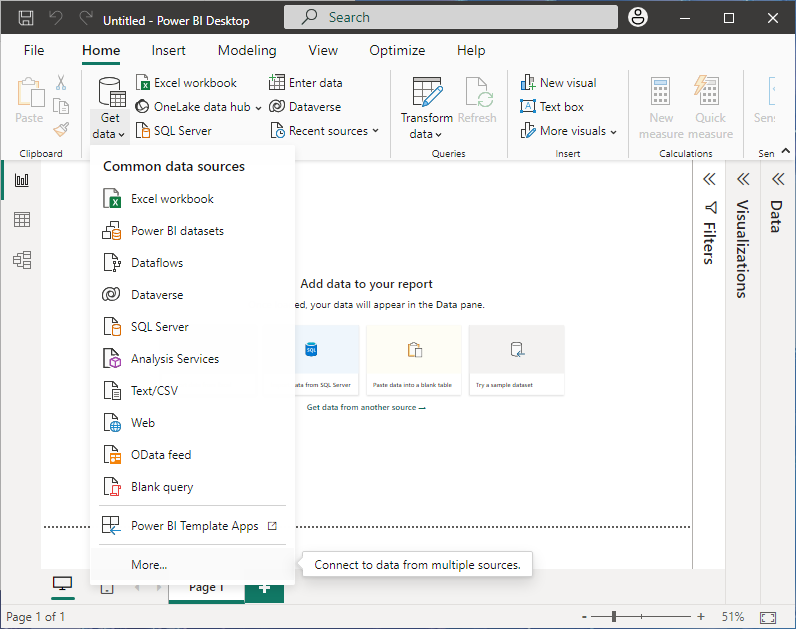
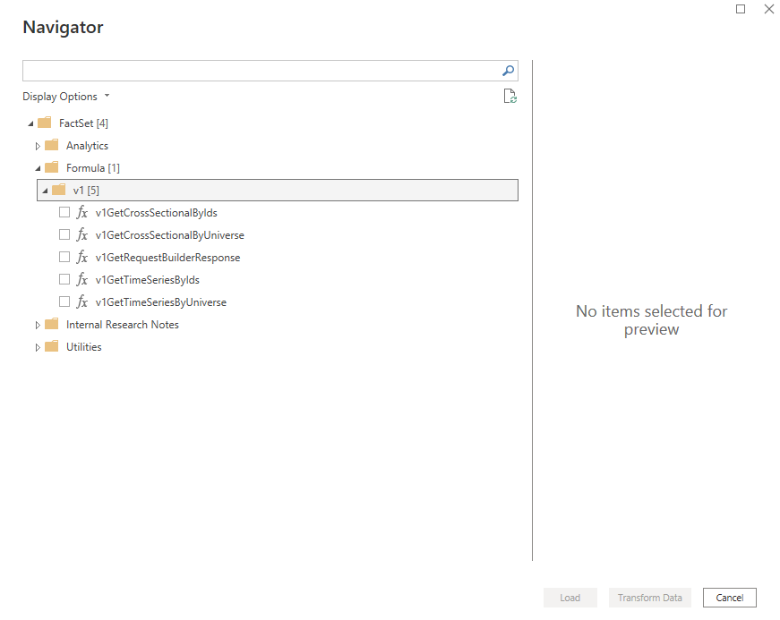

# FactSet

> [!NOTE]
> The following connector article is provided by FactSet, the owner of this connector and a member of the Microsoft Power Query Connector Certification Program. If you have questions regarding the content of this article or have changes you would like to see made to this article, visit the FactSet website and use the support channels there.

## Summary

| Item | Description |
| ------- | ------------ |
| Release state | General Availability |
| Products supported | Power BI (Semantic models) Power BI (Dataflows) Fabric (Dataflow Gen2) |
| Authentication types supported | API Key Organizational account |
| Function reference documentation | https://developer.factset.com |

## Prerequisites

To start using the FactSet connector, the following prerequisite steps need to be completed.

* Download Power BI
  * Please ensure that you are using the latest version of Power BI, as the latest major update to FactSet will only be available there. Any subsequent major or minor version updates will only be available by upgrading Power BI.

* Subscription & Authentication
  * To access FactSet's data, the appropriate subscription is required. Please contact your FactSet representative for more details.
  * With the subscription in place, the next step is to choose your authentication method. You can either generate an API key from the [Developer Portal](https://developer.factset.com/learn/authentication-api-key), or you can authenticate using the "Use FactSet Login" option (recommended).

## Connect to FactSet from Power BI Desktop

To import data using FactSet from Power Query Desktop, take the following steps:

1. **Open Power BI Desktop**

    On the Power BI Desktop home page, under section **"Get Data" -> "More…"**

    

2. **Connect to FactSet**

    Search for **FactSet** in the **Get Data** pop-up and select the **FactSet** connector from the right-hand list. **Note:** This connector serves as a unified solution, incorporating all the contents from previous FactSet connectors.

    

3. **Authentication page**

    You will be prompted to sign in using your FactSet credentials. Alternatively, you can enter the Username - Serial and the API key. Please see the [FactSet Developer Portal](https://developer.factset.com/manage-api-keys) for additional instructions on setting up an API Key.

    

4. **FactSet Navigator**

    FactSet will open a Navigator with a list of all functions provided. Please note that all functions may not be available depending on your subscriptions; your account team can assist with requirements for access to additional products. Navigate to and select all the desired endpoint(s). Choose **Load** to import the data, or select **Transform Data** to proceed with data transformation in the Power Query editor.

    

5. **Use Functions in FactSet**

    A form will populate in the query window with parameter fields to guide you. You can use the [Developer Portal](https://developer.factset.com/api-catalog) for more detail on the types of values accepted for each parameter and detail about the responses.

6. **Result Format**

    Results will be returned as a table and can be used to build your visualizations.
